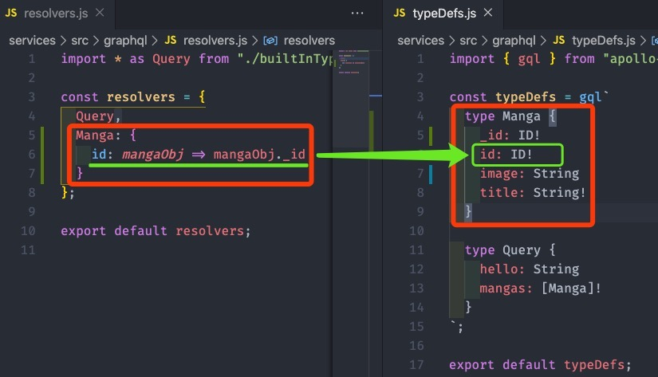

# pwa-manga-reader

## Services

### Initial

- `yarn init`
- `yarn add @babel/core @babel/register @babel/preset-env`
- `yarn add babel-watch`

```js
// babel.config.js
module.exports = {
  presets: ['@babel/env'],
};
```

```json
// package.json
"devDependencies": {
  "@babel/core": "^7.9.0",
  "@babel/preset-env": "^7.9.5",
  "@babel/register": "^7.9.0",
  "babel-watch": "^7.0.0"
},
"scripts": {
  "watch": "babel-watch index.js"
}
```

### Notes

- `yarn add dotenv express`
- 最基础的 `express` 模块

```js
import express from 'express';

const port = process.env.PORT || 3000;

const app = express();

app.all('*', (req, res) => {
  res.status(404).json({ status: "Missing endpoint" });
});

app.listen(port, '0.0.0.0', () => console.log(`Services listening on ${port}`));
```

- `yarn add apollo-server-express`
- 最基础的 `graphql-server` 模板

```js
import express from 'express';
import { ApolloServer } from 'apollo-server-express';

import resolvers from '../graphql/resolvers';
import typeDefs from '../graphql/typeDefs';

const port = process.env.PORT || 3000;

const apolloServer = new ApolloServer({
  typeDefs,
  resolvers,
});

const app = express();

apolloServer.applyMiddleware({ app, path: '/graphql' });

app.all('*', (req, res) => {
  res.status(404).json({ status: 'Missing endpoint' });
});

app.listen(port, '0.0.0.0', () => console.log(`Services listening on ${port}`));
```

- `yarn add @babel/node`

```json
"scripts": {
  "start:dev": "babel-node src/index.js",
  "watch": "babel-watch src/index.js"
}
```

### 入口文件正确引入 dotenv

```js
import 'dotenv/config'
```

### 封装 cron

- `yarn add node-cron`

```js
import 'dotenv/config'
import axios from 'axios';
import cron from 'node-cron'

const axiosInstance = axios.create({
  baseURL: process.env.MANGA_EDEN_URL
})

const seed = async () => {
  const res = await axiosInstance.get();
  console.log(res.data.manga.length);
}

seed();

cron.schedule('0 * * * *', () => {
  console.log('running a task every hour');
});
```

### babel-alias

- `yarn add -D babel-plugin-module-resolver`

```bash
{
  "plugins": [
    ["module-resolver", {
      "root": ["./src"],
      "alias": {
        "#root": "/",
      }
    }]
  ]
}
```

### graphql resolvers



## Reader-App

### Initial Reader-App

- `yarn init`
- `yarn add -D parcel-bundler`

```html
<!DOCTYPE html>
<html lang="en">
<head>
  <meta charset="UTF-8">
  <title>Manga Reader</title>
</head>
<body>
  <div id="app"></div>
  <script src="index.js"></script>
</body>
</html>
```

```js
import React from 'react'
import { render } from 'react-dom';

render(<h1>Working</h1>, document.getElementById('app'));
```

```json
"scripts": {
  "watch": "parcel src/index.html"
},
```

> Part #4 - 19:14
